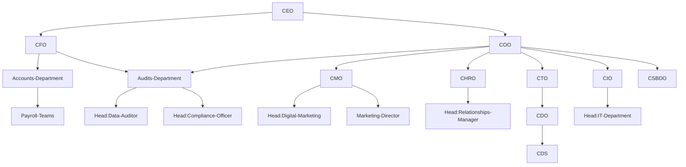

  #  <b><code>< neuralNOD /></code></b>
  
   Hello there, this is the  **`homepage`** to **`neuralNOD`** an AI-ML focused  organization (in-development) working to provide code solutions to *everyday* global problems. The company practices *research*, *data* and **_scientific computing_** using modern computational power. We're currently creating something magical for the community!

## Organization Structure

One of the most crucial steps in the application industry is to determine a correct organizational structure to achieve optimal business solutions. There are two basic types of models - (I) *silo model* - a type where each team is aligned with a specific business function or domain, and (II) *system integrator* - a type where a team is developed by grouping people with similar skills. A bare minimal organization structure is defined as below:

The elaborate structure and working of several departments may often overlap, however a general structure of the organization is developed. The in-line products are mostly developed using *open-source* software; thus, `CDO` and `CIO` work overlaps with managing a centralized repository.

---

  **_`collect, transform, understand, build, verify, retrain`_**

